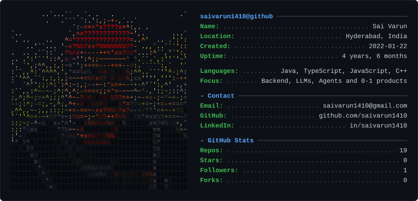

# termfetch

A [neofetch](https://github.com/dylanaraps/neofetch)-style profile card for your GitHub
README — your photo as coloured terminal art on the left, live GitHub stats on the right,
rendered to a single self-contained SVG.



The card is a **static SVG committed to your repo**, not a hosted image. Nothing calls out to
a third-party service when someone loads your profile, so there's no rate limit to hit and
nothing that can go down and leave a broken image on your README. A scheduled GitHub Action
regenerates it so the numbers stay current.

## Quickstart

```bash
pip install pillow
git clone https://github.com/saivarun1410/termfetch && cd termfetch

python -m termfetch --config examples/config.json --out card.svg
```

Then in your README:

```markdown

```

`--no-fetch` skips the GitHub API entirely if you just want to iterate on the art.

## Configuration

Everything lives in one JSON file.

```json
{
  "github": "saivarun1410",
  "image": "assets/me.jpg",
  "imageCrop": [630, 0, 780, 780],
  "imageCols": 52,
  "charset": "blocks",
  "theme": "github-dark",
  "panelAlign": "middle",
  "sections": [
    {
      "title": "{{username}}@github",
      "fields": [
        ["Name", "{{name}}"],
        ["Member for", "{{uptime}}"],
        ["Editor", "Neovim"]
      ]
    }
  ]
}
```

### Image

| Key | Default | Notes |
| --- | --- | --- |
| `image` | – | Path to the source image, relative to the config file. |
| `imageCrop` | whole image | `[x, y, width, height]` in source pixels, applied before scaling. |
| `imageCols` | `56` | Width in characters. Row count follows from the aspect ratio. |
| `charset` | `blocks` | `ascii`, `blocks`, or `solid`. See below. |
| `coloredImage` | `true` | `false` renders in the theme's single foreground colour. |
| `contrast` / `brightness` / `gamma` | `1.2` / `1.0` / `1.05` | Applied before sampling. |
| `colorStep` | `8` | Colour quantisation. Higher merges more cells and shrinks the SVG. |
| `invert` | `false` | Flip the brightness-to-character mapping. |

**Choosing a charset.** `ascii` uses a ` .:-=+*#%@`-style ramp and looks the most like real
neofetch output, but it maps brightness to character density — so a backlit photo, where the
subject is darker than the background, comes out as a hole. `blocks` (` ░▒▓█`) keeps the
terminal texture while letting colour carry the image, and is the safest default for a
photograph. `solid` fills every cell with `█`, which is the clearest but reads as pixel art
rather than terminal art.

**Cropping.** The card looks best framed on a face. Find the pixel coordinates however you
like — this snippet prints a labelled grid over your image:

```python
from PIL import Image, ImageDraw
im = Image.open("assets/me.jpg"); d = ImageDraw.Draw(im)
for x in range(0, im.width, 200):  d.line([(x,0),(x,im.height)], fill="cyan", width=4); d.text((x+6,6), str(x), fill="cyan")
for y in range(0, im.height, 200): d.line([(0,y),(im.width,y)], fill="magenta", width=4); d.text((6,y+6), str(y), fill="magenta")
im.show()
```

### Layout and theme

| Key | Default | Notes |
| --- | --- | --- |
| `theme` | `github-dark` | `github-dark`, `github-light`, `dracula`, `gruvbox`, `nord`, `tokyo-night`. |
| `colors` | – | Override individual theme colours: `{"key": "#ff79c6"}`. |
| `windowTitle` | `{{username}}@github` | Text in the title bar. Empty string to omit. |
| `chrome` | `true` | Draw the title bar and traffic-light buttons. |
| `fontSize` | `13` | |
| `keyWidth` | `13` | Characters reserved for the key column. Widen if labels are truncated-looking. |
| `panelAlign` | `top` | `middle` centres the text against the art — better when you have few rows. |

### Data

| Key | Default | Notes |
| --- | --- | --- |
| `github` | – | Username to fetch stats for. Omit to use only static text. |
| `languageMode` | `repos` | `repos` counts primary language per repo (1 API call). `bytes` sums bytes actually written (1 call per repo, more representative). |
| `topLanguages` | `5` | |

Available template variables: `{{username}}`, `{{name}}`, `{{bio}}`, `{{location}}`,
`{{company}}`, `{{blog}}`, `{{repos}}`, `{{stars}}`, `{{forks}}`, `{{followers}}`,
`{{following}}`, `{{languages}}`, `{{created}}`, `{{uptime}}`, `{{today}}`.

A field is dropped when its value resolves to nothing, or when it still references a variable
there was no data for — so an unset bio leaves no dangling label, and `--no-fetch` renders a
clean card rather than one covered in literal `{{bio}}` text. Fields can also be plain strings
for a full-width line with no key column.

## Keeping it current

```yaml
name: refresh-card
on:
  schedule: [{ cron: "0 5 * * *" }]
  workflow_dispatch:

permissions:
  contents: write

jobs:
  refresh:
    runs-on: ubuntu-latest
    steps:
      - uses: actions/checkout@v4
      - uses: actions/setup-python@v5
        with: { python-version: "3.12" }
      - run: pip install pillow
      - run: python -m termfetch --config config.json --out card.svg
        env:
          GITHUB_TOKEN: ${{ secrets.GITHUB_TOKEN }}
      - run: |
          git config user.name "github-actions[bot]"
          git config user.email "41898282+github-actions[bot]@users.noreply.github.com"
          git add card.svg
          git diff --cached --quiet || { git commit -m "Refresh profile card"; git push; }
```

`GITHUB_TOKEN` is optional but raises the API rate limit from 60 requests/hour per IP to
5,000, which matters if you use `languageMode: "bytes"`.

## How it works

1. **Sample.** The image is cropped, resized to the character grid, and each cell becomes a
   character picked from a luminance ramp plus the cell's average colour.
2. **Quantise.** Colours are snapped to a coarser grid so runs of neighbouring cells share a
   value and collapse into one SVG span. This is most of the difference between a 60 KB file
   and a 300 KB one.
3. **Position every glyph explicitly.** SVGs embedded in a README render as images, so
   webfonts never load and the viewer's monospace fallback is whatever their OS provides.
   Relying on the font's own advance width would let columns drift apart on some machines, so
   each span carries an absolute `x`.

## Limitations

- Character cells are assumed to be 0.6× as wide as they are tall. That holds for the fonts in
  the stack; a wildly different fallback would shear the art slightly.
- Colour is per character cell, so effective resolution is `imageCols` × about `0.6 ×
  imageCols`. Portraits work; fine detail and text in the source image do not.
- Stats come from the public REST API, so private repositories and private contributions are
  not counted.

## Development

```bash
pip install pillow pytest
python -m pytest
```

## Licence

MIT — see [LICENSE](LICENSE). The example photograph is not covered by it; replace it with
your own.
